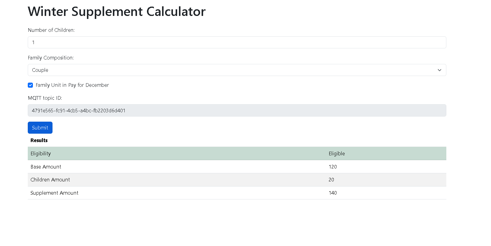
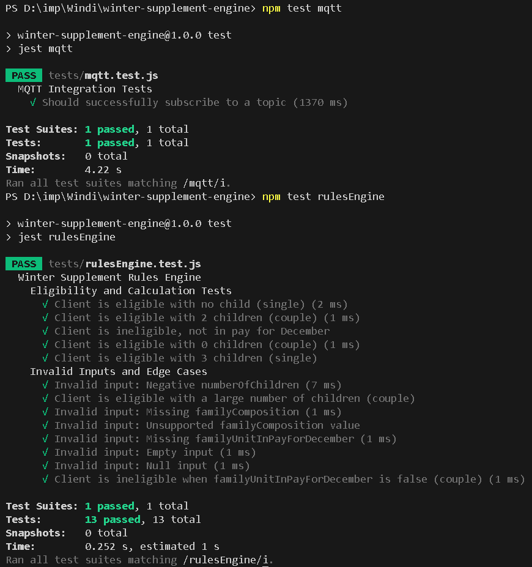

# Winter Supplement Rules Engine

## Overview

This project is a simple rules engine developed to determine client eligibility for the Winter Supplement and calculate the eligible supplement amount based on predefined rules. The engine communicates with the Winter Supplement Calculator web application using an event-driven architecture facilitated by MQTT.

## Table of Contents

1. [Setup Instructions](#setup-instructions)
2. [How to Run](#how-to-run)
3. [Testing](#testing)
4. [Message Formats](#message-formats)
5. [File Structure](#file-structure)

## Setup Instructions
### 1. Prerequisites

- **Node.js** (version 12 or higher)
- **npm** (Node Package Manager)

### 2. Cloning the Repository

```bash
git clone https://github.com/HarshitOO7/Winter-supplement-engine.git
cd winter-supplement-engine
```

### 3. Install dependencies
Install the necessary packages using npm:
```bash
npm install
```
This will install:

- **mqtt:** For MQTT communication.
- **dotenv:** For environment variable management.
- **jest:** For unit testing.

### 4. Create a .env file for secured mqtt id
Create a new .env file in the root folder -
```env
# .env file

# MQTT Broker URL
BROKER_URL=mqtt://test.mosquitto.org:1883

# Your unique MQTT ID
MQTT_ID=Your_MQTT_ID here
```
Replace **Your_MQTT_ID_here** with the MQTT topic ID from the Winter Supplement Calculator web application.

**Note:** Every time you access the web application, a new MQTT topic ID is generated. Ensure that the IDs match before running your application.


## How to Run
Ensure you have set up the environment variables before starting the application.

Run the application using:
```bash
npm start
```

**Expected Output**
- The application should connect to the MQTT broker.
- It should subscribe to the input topic.
- Upon receiving messages, it will process and publish results to the output topic.

**Example Output:**


## Testing
Unit tests are provided to validate the functionality of the rules engine.
**Run Tests**
```bash
npm test
```

**Test Coverage**
The tests cover:

- Eligibility determination.
- Calculation of base amounts.
- Handling of invalid inputs.
- Edge cases.

**Example Test Output:**


## Message Formats
Input Message Format
```JSON
{
  "id": "string",              
  "numberOfChildren": "integer",
  "familyComposition": "string",  
  "familyUnitInPayForDecember": "boolean" 
}
```

Output Message Format

```JSON
{
  "id": "string",                   
  "isEligible": "boolean",        
  "baseAmount": "float",            
  "childrenAmount": "float",       
  "supplementAmount": "float"     
}

```


## File Structure
```
winter-supplement-engine/
├── index.js                  # Main application file
├── helpers/
│   └── rulesEngine.js        # Rules engine logic
├── tests/
│   └── rulesEngine.test.js   # Unit tests for the rules engine
├── .env                      # Environment variables file
├── package.json              # Project metadata and dependencies
├── package-lock.json         # Auto-generated dependency tree
└── README.md                 # Project documentation
```
